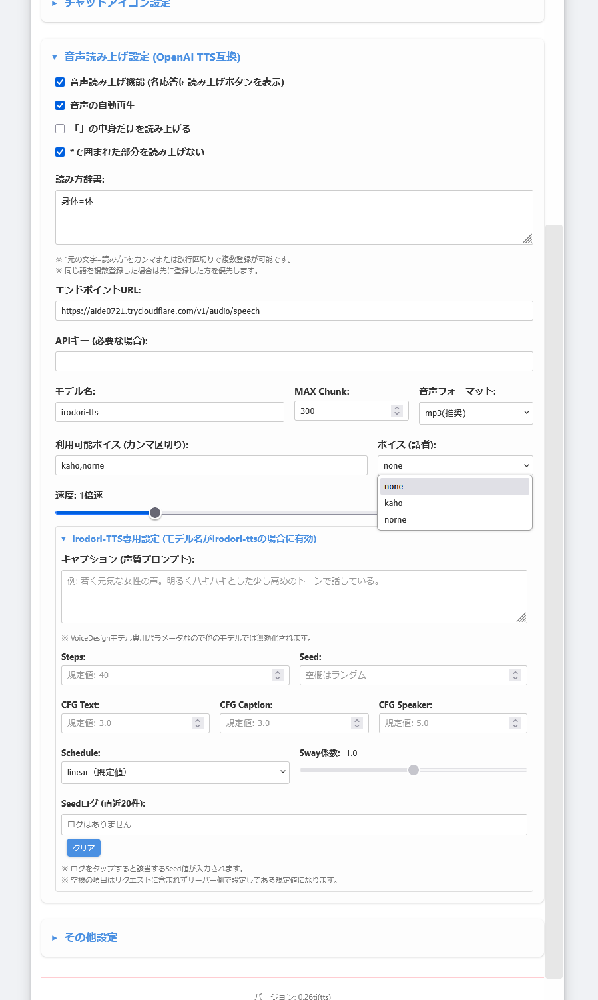

# 概要
- 本リポジトリはtitan823氏のti版GeminiPWA(<https://github.com/titan823/geminipwa>)をフォークし、TTS(音声読み上げ)機能を追加した私用の派生版です
- 系譜: 本家ona-oni/geminipwa→titan823/geminipwa→本リポジトリ
- ここではTTS機能に関する説明のみ記しておきますので、経緯やその他の全機能の詳細はフォーク元のREADMEを参照してください

## ■ 経緯
元々はどうにか簡単にTTSサーバーを使えないかと思ってノートブックを作っていたのが始まりで、SillyTavernを用意できない人はどうする？と考えた結果、個人的に愛用していたtitan版でのPWA制作に着手しました

## ■ 利用方法(PWA)
- 当PWAもフォーク元と同様ブラウザからGitHub Pagesにて利用できます: [GitHub Pages](https://aide0721.github.io/geminipwa/#chat)
- TTSサーバーはどうすれば？という人はこちら: 

# 追加機能: TTS
エンドポイントURL、モデル、ボイスなどを設定してサーバーに音声リクエストします

- 使い方: 音声読み上げ機能にチェックを入れるとチャットにボタンが追加され、それを押すと指定されたボイスで読み上げます
- MAX Chunk: 1回の送信文字数上限
    - エラーの原因が音声リクエストの長さであれば、数値を下げることでリクエストが分割されてエラーが回避できます
    - 数値を上げるほど生成にかかる時間も伸びますが、長文が途切れずに読まれます
- 音声フォーマット: 出力される音声形式を指定できますが、利用するTTSやブラウザによっては対応していないフォーマットがあるのでmp3が一番無難です
- 読み方辞書: 想定外の読みをされてしまう単語を、事前に登録しておいた読み方に置き換えてリクエストする機能です

## ■ Irodori-TTS 専用設定
Irodori-TTS-Server専用の生成パラメータです

- モデル名が「irodori-tts」の場合のみ有効化され、他のOpenAI互換サーバーの利用時には影響しません
- 空欄の項目はサーバー側の既定値が適用されるので必要な項目だけを設定すれば機能します
- キャプション: 声質や話し方を文章で指示するVoiceDesign機能
    - 例えるなら声のプロンプト
    - VoiceDesignモデルにのみ有効で、それ以外のモデルでは無視されます
    - ボイス(参照音声)との併用は声質の指示よりも感情や話し方などを指示する方が効果的です
- Steps: 音声生成の反復回数
    - 下げるほど生成が速くなり、上げるほど高品質になります
    - 後述のScheduleとSway係数に関連します
- Seed: 生成に使う乱数シード
    - 数値を入れて固定すると同じ声・同じ読み方を再現できます
    - 本文の内容も影響するのでSeed値通りの声になるとは限りません
- CFG Text/Caption/Speaker: それぞれ本文・キャプション・参照音声にどれだけ忠実に従うかの強さ
    - 上げるほど強く従いますが、上げすぎると音声が破綻することがあります
    - 公式デモのCFG Captionは4.0です
- Schedule/Sway係数: サンプリングにおけるタイムステップの刻み方を決めるパラメータ方式
    - linear(既定値)ではタイムステップが等間隔です
    - Stepsを下げて高速化したいときはswayにすると品質の低下を抑えられます
    - Sway係数はsway選択時のみ扱う数値で、0に近づくほどlinearと同じ等間隔になります

# 注意事項
- 本PWAを初めてのデバイスから使用する場合は、必ず無料モデルを用いて必要最低限の機能構成からテストしてください。
- 当フォークはデバッグを十分に行ったとは言えず、うまく動作しなかったり、不具合が発生する場合があります。積極的にサポートをする予定はなく、また予告なく削除する可能性もあるのでご了承ください。
- PWA使用中に解決困難な問題が生じた場合は本PWAに関するキャッシュを全て削除することを推奨致します。
- 各種データは必ず各ユーザー様のご裁量で保存を行なってください。当アプリはアプリ内での恒久的なデータ保存や自動バックアップは意図されておりません。
- 本コードは本家(ona-oni/geminipwa)ないしフォーク元(titan823/geminipwa)の後継となることを意図するものでは断じてございません。すべての系譜のフォーク元コードに対し異を唱える意図も、開発を阻害する意図なども一切ございません。
- 本家またはフォーク元コードの製作者様を除き、ご質問・ご意見・ご要望は承りません。また、本コードによって損害や影響が生じた場合においても、公開陣は一切の責任を負いません。
- 本コードの利用基準(改変、フォーク、他コードへの流用など)はフォーク元に準拠します。(MITライセンス)

## ■ Dependencies
This project uses the following third-party libraries:

*   **Marked.js:** [MIT License](https://github.com/markedjs/marked/blob/master/LICENSE.md) - Used for rendering Markdown.